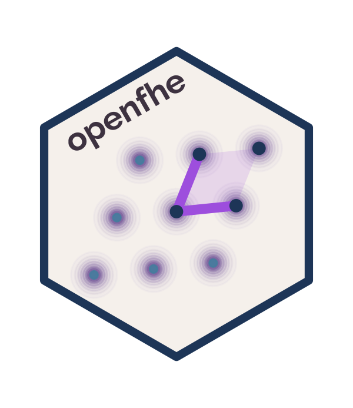

# openfhe 

R Interface to the [OpenFHE](https://github.com/openfheorg/openfhe-development)
Fully Homomorphic Encryption library.

## Status

As of **v1.1.5-1** (2026-04-15): **Block E DONE — first R release
cut against OpenFHE 1.5.** 917 tinytest assertions passing,
0 failures. Full `R CMD check --as-cran` clean at 0 ERRORs /
0 WARNINGs / 3 NOTEs (all benign, local dev environment).
13 vignettes rebuild cleanly (11 from Block E + 2 new:
`ckks-bootstrapping` and `binfhe-boolean-circuits`).
pkgdown site up to date, articles reorganized into Basic
Use / Applications / Advanced. Versioning: the new
OpenFHE-tracked `<R>.<M>.<m>-<R_rev>` scheme (see
`notes/maintenance-workflow.md`) supersedes the Block-E-era
`0.0.0.9NNN` convention from `1.1.5-1` forward.

v0.0.0.9124 closes 9100.8 entirely — and closes Block E
entirely. Block E delivered ~200 new cpp11 bindings +
~200 new R surface symbols + ~340 new tinytest assertions
(576 → 917) across 25 per-commit sub-releases from 9101
to 9124. 9124 is the administrative capstone: P3/P4
`UNVERIFIED` entries resolved to N/A after header
re-read, `notes/test_parity.md` retired, tolerance
regression guard landed, full release dance. Post-Block-E
2.0.0 polish items (vignette verification, empirical
tolerance validation, pkgdown redeployment) tracked in
the project root README.

v0.0.0.9123 closed 9100.7 with the CKKS complex plaintext
round-trip and automorphism surface. 6 new cpp11 bindings +
5 new R surface symbols. `make_ckks_packed_plaintext()`
gains `is.complex()` dispatch; new
`get_complex_packed_value()`, `find_automorphism_index()`,
`find_automorphism_indices()`, `eval_automorphism_key_gen()`,
and `eval_automorphism()`. Complex plaintexts need
`ckks_data_type = CKKSDataType$COMPLEX` at context
construction. Next: **9100.8** (final housekeeping, closes
Block E).

v0.0.0.9122 closed 9100.6 with the vector-form
`eval_bin_gate(ctx, gate, ct_list)` overload for the
3+-input gates (MAJORITY, AND3, OR3, AND4, OR4, CMUX). The
R wrapper gains optional-NULL `ct2` dispatch; list-in-`ct1`
with NULL `ct2` routes to the new vector binding, preserving
positional backward-compat for the 2-input form. `eval_sign`
roxygen tightened. 9100.6 sub-series delivered 2 cpp11
additions + 1 latent R wrapper + 1 enum-drift bug fix +
1 docs review across 9121 / 9122. **Next**: 9100.7 (CKKS
complex plaintext, mostly cut-line).

v0.0.0.9121 opens the 9100.6 BinFHE arg-completion sub-series.
`bin_bt_key_gen()` gains `keygen_mode` arg; new `eval_floor()`
R wrapper closes a latent gap; and the enum verification sweep
**surfaced and fixed a latent drift bug** — `R/binfhe.R`
carried stale duplicate definitions of `BinFHEParamSet` /
`BinFHEMethod` / `BinGate` that shadowed the authoritative
lists in `R/enums.R` (loaded first, overwritten later by
`binfhe.R`). Latent since the 9101 enum expansion. Fixed by
deleting the duplicates. The 44 / 4 / 14 value enums now
load correctly.

v0.0.0.9120 closed 9100.4 entirely with sum-key file-based
`serialize_eval_keys(type = "sum")` / `deserialize_eval_keys
(type = "sum")`. 2 new cpp11 bindings. Cross-entry
equivalence with the automorphism entry point verified
end-to-end. Both new entry points are openfhe-python absent
(R-first). 9100.4 sub-series delivered 9 new cpp11 bindings
+ 10 new R surface symbols across 9118 / 9119 / 9120.
**Next**: 9100.6 (BinFHE arg completion).

v0.0.0.9119 was the 9100.4/2 sub-step: eval-key getter fleet.
4 new cpp11 bindings + 4 R wrappers expose read-only
diagnostic access to the cc-internal eval-key registry:
`get_all_eval_mult_keys()`, `get_eval_mult_key_vector(tag)`,
`get_all_eval_automorphism_keys()`, and `get_all_eval_sum_keys()`.
Interacts cleanly with the 9118 clear surface; the shared
backing storage for automorphism and sum keys is visible
through both getters.

v0.0.0.9118 opens the 9100.4 serialization / key-management
sub-series with `InsertEvalMultKey` + single-tag clear
overloads for the EvalMult and EvalAutomorphism key caches.
3 new cpp11 bindings. R surface adds `insert_eval_mult_key()`
plus `clear_eval_mult_keys(key_tag = NULL)` /
`clear_eval_automorphism_keys(key_tag = NULL)` where `NULL`
routes to the pre-existing no-arg forms and a character tag
routes to the new tag-scoped overload.

v0.0.0.9117 closes 9100.3 with `KeySwitchDown` + the IntBoot
4-function family + IntMPBoot 6-function family (inherited
from 9100.5). 11 new cpp11 bindings covering the
single-party and multi-party interactive bootstrap protocols
plus the ext-basis scale-down that returns ciphertexts from
P*Q to Q. `key_switch_down` has no openfhe-python binding
(R-first, logged in `upstream-defects.md`). Next: 9100.4
(serialization / key management).

v0.0.0.9116 was the 9100.3/2 sub-step: CKKS bootstrap
correction factor + `EvalFastRotationExt` + 3-arg
`EvalFastRotation` convenience overload. 4 new cpp11
bindings. `get_ckks_boot_correction_factor()` /
`set_ckks_boot_correction_factor()` for post-setup
programmatic control; `eval_fast_rotation_ext()` for the
ext variant used inside CKKS bootstrap; existing
`eval_fast_rotation()` extended with an optional
`m = NULL` argument that routes to the new 3-arg
binding. Closes design.md §11 open question #1: the
phantom 3-arg form is a real C++ header overload
(cryptocontext.h line 2395), not a Python defect.

v0.0.0.9115 opens the 9100.3 CKKS advanced / bootstrap
sub-series. 4 new cpp11 bindings expose per-algorithm
variants of the Poly and Chebyshev evaluators:
`eval_poly_linear`, `eval_poly_ps`, `eval_chebyshev_linear`,
`eval_chebyshev_ps`. `eval_poly` / `eval_chebyshev` remain
name-stable as the default-selector entry points. The
`eval_bootstrap_setup()` R wrapper gains the missing
`bt_slots_encoding` argument (default `FALSE`) per
cryptocontext.h line 3513.

v0.0.0.9114 was the 9100.5/3 sub-step: vector-form distributed
decryption + secret sharing. 4 new cpp11 bindings
(`MultipartyDecryptLead__ct_vec`, `MultipartyDecryptMain__ct_vec`,
`CryptoContext__ShareKeys`, `CryptoContext__RecoverSharedKey`).
New `SecretShareMap` S7 class + `share_keys()` /
`recover_shared_key()` wrappers covering the OpenFHE abort-
recovery flow (both `"additive"` and `"shamir"` sharing schemes).
`multiparty_decrypt_lead()` / `_main()` refactored to accept
either a single `Ciphertext` or a list for batch partial
decryption. End-to-end 3-party BFV abort-recovery tested: kp1's
secret reconstructed from shares (both schemes) and used in
place of the original in the threshold decrypt. Upstream gap:
`ShareKeys` and `RecoverSharedKey` are R-first — no
openfhe-python binding exists. Logged in
`notes/upstream-defects.md`.

v0.0.0.9113 was the 9100.5/2 sub-step: `EvalKeyMap` S7 class +
the multi-eval-key family. 9 new cpp11 bindings (3 MultiEval*KeyGen,
2 MultiAddEval*, plus GetEvalSumKeyMap / GetEvalAutomorphismKeyMapPtr
/ InsertEvalSumKey / InsertEvalAutomorphismKey helpers) and a
new `EvalKeyMap` S7 class wrapping
`shared_ptr<std::map<uint32_t, EvalKey<DCRTPoly>>>`. The full
2-party BFV sum-key flow is tested end-to-end: each party
generates its share, the shares combine via
`multi_add_eval_sum_keys()`, the joined map is inserted into
the cc registry, and `eval_sum()` under the joined keys
round-trips through the 2-party threshold decrypt. Also adds
a standalone `eval_sum_key_gen(cc, sk)` wrapper (cpp11
binding existed but had no R entry point).

v0.0.0.9112 opened the 9100.5 threshold/multiparty sub-series
with argument completion on the since-9021 surface. `multiparty_key_gen()`
gains `make_sparse` + `fresh`; `multi_add_pub_keys()`,
`multi_add_eval_keys()`, and new `multi_add_eval_mult_keys()`
gain `key_tag` that round-trips through `get_key_tag()`. New
`multi_key_switch_gen()` R wrapper exposes the since-9021 cpp11
binding. All multiparty bindings wrapped in `catch_openfhe`.
9112 is the first of four planned 9100.5 sub-steps.

v0.0.0.9111 closed 9100.2 entirely with the Eval\* arg completion
surface: 20 new cpp11 bindings and 16 new S7 generics covering
the in-place family (`eval_add_in_place`, `eval_sub_in_place`,
`eval_mult_in_place`, `eval_negate_in_place`), the mutable family
(`eval_add_mutable`, `eval_sub_mutable`, `eval_mult_mutable`,
`eval_square_mutable`), the no-relin + relinearize family
(`eval_mult_no_relin`, `relinearize`, `eval_mult_and_relinearize`),
and the mod/level reduce + compress family (`mod_reduce`,
`mod_reduce_in_place`, `level_reduce`, `level_reduce_in_place`,
`compress`). `mod_reduce` is a synonym for `rescale`. Next comes
9100.5 (threshold / multiparty).

v0.0.0.9110 was the Ciphertext accessor + `fhe_ckks_tolerance()`
Stage 2 sub-step of 9100.2. Added 14 new Ciphertext accessor
cpp11 bindings and 1 new `GetScalingFactorReal` lambda-routed
binding (deferred from 9109). Exposes the Ciphertext accessors
as S7 methods on existing 9106/9107 generics (`get_level`,
`set_level`, `get_slots`, `set_slots`, `get_noise_scale_deg`,
`set_noise_scale_deg`, `get_scaling_factor`, `set_scaling_factor`,
`get_scaling_factor_int`, `set_scaling_factor_int`,
`get_encoding_type`, `get_key_tag`, `set_key_tag`). New generics:
`get_crypto_context(ct)`, `get_scaling_factor_real(cc)`, plus
the `ckks_scaling_factor_bits(cc)` R helper. Converts
`fhe_ckks_tolerance()` from a plain function to an S7 generic
with `class_numeric` (Stage 1) and `Ciphertext` (Stage 2) methods.
Design.md §11 Q5 closes here.

9109 (CryptoContext getter fleet) is commit `08222dd`.

All four FHE subsystems operational: **BFV**, **BGV**, **CKKS**, **BinFHE**.
Plus serialization, threshold FHE, CKKS bootstrapping, transcendental
function evaluation, and CKKS hoisted (fast) rotations.

## Quick Start

```r
library(openfhe)

# BFV: exact integer arithmetic
cc <- fhe_context("BFV", plaintext_modulus = 65537, multiplicative_depth = 2)
keys <- key_gen(cc, eval_mult = TRUE)

ct1 <- encrypt(keys@public, make_packed_plaintext(cc, 1:8), cc = cc)
ct2 <- encrypt(keys@public, make_packed_plaintext(cc, 10:17), cc = cc)

# Compute on encrypted data
result <- decrypt(ct1 + ct2, keys@secret, cc = cc)
get_packed_value(result)[1:8]
#> [1] 11 13 15 17 19 21 23 25
```

## Schemes

- **BFV / BGV**: exact integer arithmetic
- **CKKS**: approximate real-number arithmetic (with sin, cos, logistic, bootstrapping)
- **FHEW / TFHE (BinFHE)**: Boolean circuit evaluation

## Why this matters

Existing R statistical procedures — `mle`, `optim`, `glm`'s fitter,
MCMC samplers — accept a likelihood (or loss) as a callback. With
`openfhe` you can make the callback drive a homomorphic-encryption
protocol across multiple sites, and the procedure runs unchanged.
**Privacy-preserving distributed statistics does not require
rewriting the optimizers you already use.** See the `mle` and `cox`
vignettes for worked examples that reproduce cleartext fits exactly.

## Predecessor

`openfhe` is the successor to
[homomorpheR](https://github.com/bnaras/homomorpheR), which
demonstrated privacy-preserving distributed computation using
Paillier encryption.
